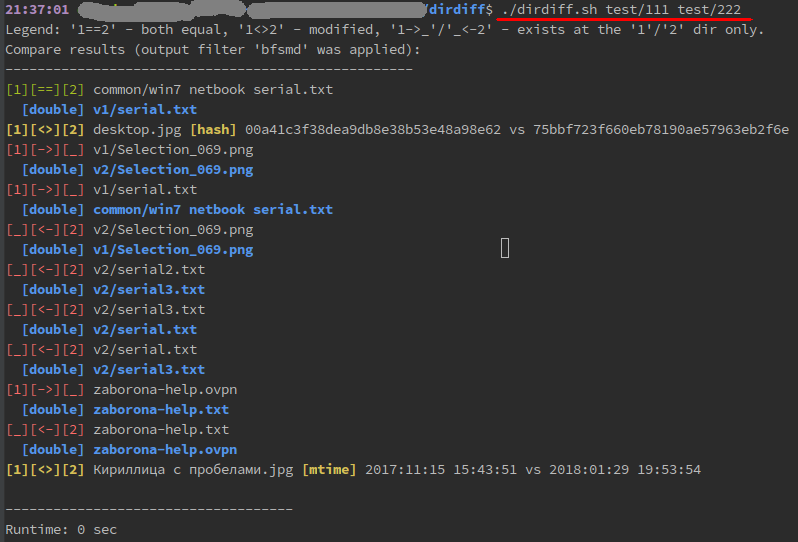

# Directory compare tool

This tool automatically and recursively compares directories 

### Use-cases

##### Root level

Folder 1 | Folder 2 | Comment | Output
--- | --- | --- | ---
common | common | equal | [equal] > common
Кириллица с пробелами.jpg | Кириллица с пробелами.jpg | equal | [equal] > Кириллица с пробелами.jpg
same_hash_diff_mtime.jpg | same_hash_diff_mtime.jpg | equal `content` (`hash`) diff `modification time` | [diff] > [t] same_hash_diff_mtime.jpg [mtime] 2017:11:15 15:43:51 vs 2018:01:29 19:53:54
bits.jpeg | bits.jpeg | equal name, diff 1 bit | [diff] > [h] bits.jpeg [hash] 123 vs 321
same_name.jpg | same_name.jpg | equal only name | [diff] > [h] same_name.jpg [hash] 123 vs 321
file1.jpg | - | exists only in **Folder 1** | [uniq] > [1] file1.jpg
 - | file2.jpg | exists only in **Folder 2** | [uniq] > [2] file2.jpg

##### Sub level

Folder 1 | Folder 2 | Comment | Output
--- | --- | --- | ---
sub 1/file with space.jpg | sub 1/file with space.jpg | equal | [equal] > sub 1/file with space.jpg
sub 1/file1.jpg | - | exists only in **Folder 1** | [uniq] > [1] sub 1/file1.jpg
sub 1/sub2/sub-common.jpg | sub 1/sub2/sub-common.jpg | equal | [equal] > sub 1/sub2/sub-common.jpg
 - | sub 1/Уровень 2/Азбука Кириллица.jpg | exists only in sub-folder of **Folder 2** | [uniq] > [2] sub 1/Уровень 2/Азбука Кириллица.jpg

##### Different level

Folder 1 | Folder 2 | Comment | Output
--- | --- | --- | ---
common_diff-sub-folder.jpeg | sub 1/sub2/common_diff-sub-folder.jpeg | equal files are in **Folder 1** and in sub-folder of **Folder 2**  | [double] > [1] common_diff-sub-folder.jpeg [2] sub 1/sub2/common_diff-sub-folder.jpeg
sub 1/sub2/sub_same_name.jpg | sub 1/sub_same_name.jpg | files having same name are in sub-folders of **Folder 1** and **Folder 2** | [diff] > [h] [1] sub 1/sub2/sub_same_name.jpg [2] sub 1/sub_same_name.jpg [hash] 123 vs 321
sub_same_hash_diff_mtime.jpeg | sub 1/sub_same_hash_diff_mtime.jpeg | similar files having same hash but diff `modification time` are in **Folder 1** and in sub-folder of **Folder 2** | [diff] > [t] [1] sub_same_hash_diff_mtime.jpeg [2] sub 1/sub_same_hash_diff_mtime.jpeg [mtime] 2017:11:15 15:43:51 vs 2018:01:29 19:53:54

##### Multiple copies

Folder 1 | Folder 2 | Comment | Output
--- | --- | --- | ---
multi-copied.jpg | multi-copied.jpg | same level | [equal] > multi-copied.jpg
multi-copied.jpg | sub 1/multi-copied.jpg | sub 1 | [double] > [1] multi-copied.jpg [2] sub 1/multi-copied.jpg
multi-copied.jpg | sub 1/sub2/multi-copied.jpg | sub2 | [double] > [1] multi-copied.jpg [2] sub 1/sub2/multi-copied.jpg

### License

See the [LICENSE](LICENSE) file for license rights and limitations (Apache License v2.0).
